# Folded Flight

<div align="center">

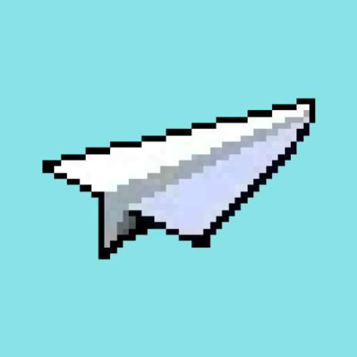

**An arcade-style paper plane flying game with retro 8-bit pixel art aesthetics**

[](https://www.android.com/)
[](https://android-arsenal.com/api?level=27)

[Features](#features) • [Gameplay](#gameplay-mechanics) • [Screenshots](#screenshots) • [Installation](#installation)

</div>

---

## 📖 Overview

**Folded Flight** is a physics-based endless runner where you pilot a paper plane through challenging obstacles. Featuring realistic flight mechanics, multiple environments, and competitive scoring, it delivers an addictive arcade experience wrapped in nostalgic pixel art.

### Key Highlights
- Paper plane physics simulation
- Two maps (City & Forest)
- Four plane colors
- 💰 Coin collection system
- 🏆 Persistent high score leaderboard
- 🎯 Two difficulty levels
- 📱 Optimized for landscape gameplay

---

## ✨ Features

### Plane Selection

Choose your style! Select from four distinct paper plane colors:

<div align="center">

| White Plane | Red Plane | Blue Plane | Yellow Plane |
|:-----------:|:---------:|:----------:|:------------:|
| 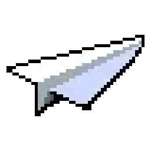 | 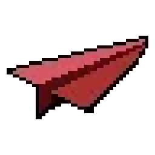 | 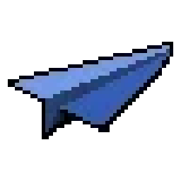 | 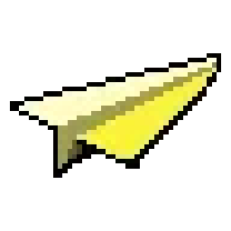 |

</div>

---

### Map Environments

#### City Map
Navigate through an urban skyline filled with architectural obstacles.

<div align="center">

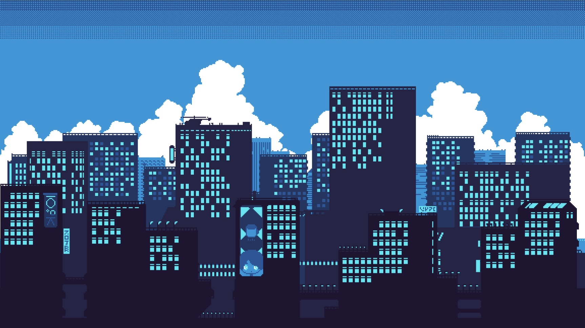

| Building | Lamppost | Jet | Alien | Bird |
|:--------:|:--------:|:---:|:-----:|:----:|
| 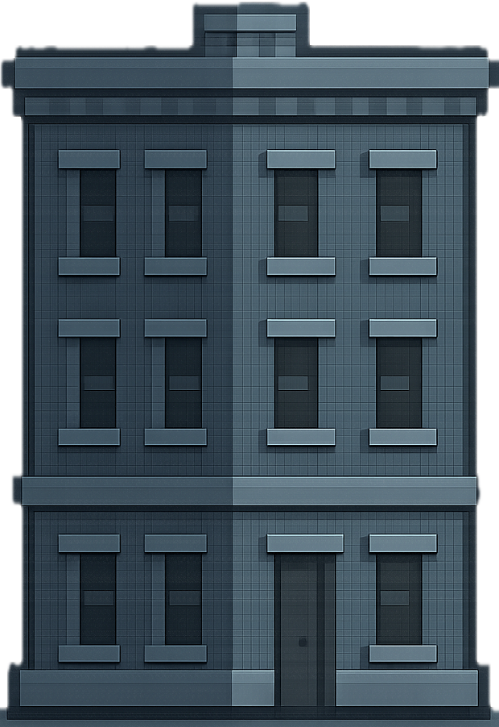 |  | 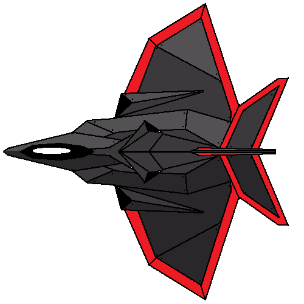 | 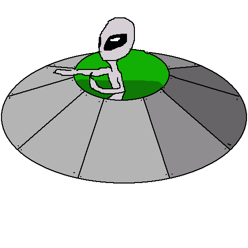 | 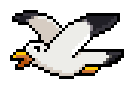 |

</div>

**City Obstacles:**
- **Building**: Tall ground obstacle at 50% screen height
- **Lamppost**: Medium ground obstacle at 30% screen height
- **Jet**: High-speed aerial threat
- **Alien**: Unpredictable flying obstacle
- **Bird**: Small, nimble flying hazard

---

#### Forest Map
Venture through a mystical woodland with supernatural challenges.

<div align="center">

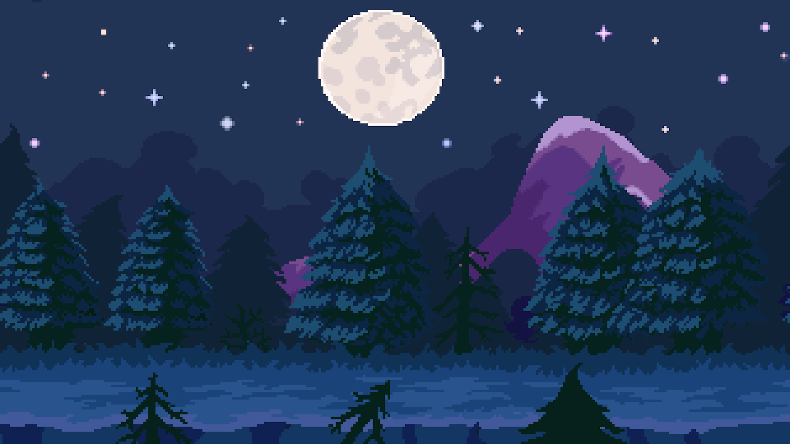

| Tree | Zombie | Ghost 1 | Ghost 2 |
|:----:|:------:|:-------:|:-------:|
| 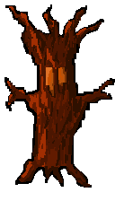 | 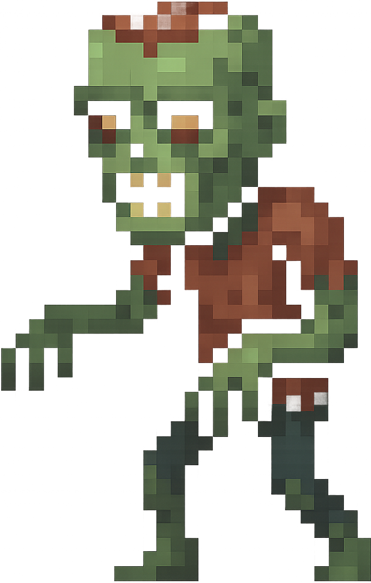 | 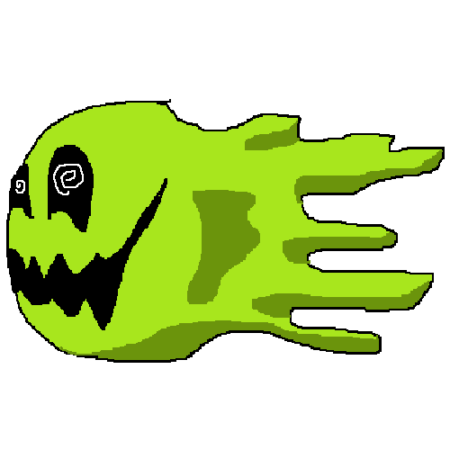 | 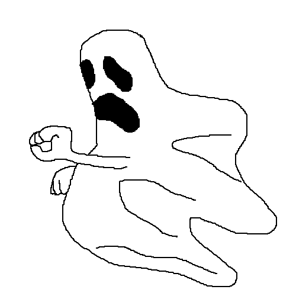 |

</div>

**Forest Obstacles:**
- **Tree**: Towering forest obstacle at 50% screen height
- **Zombie**: Undead ground threat at 30% screen height
- **Ghost Type 1**: Spectral flying hazard
- **Ghost Type 2**: Alternative ghost variant

---

### Collectibles

<div align="center">

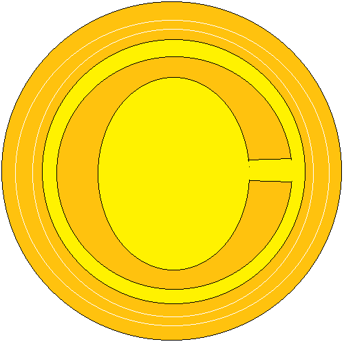

**Golden Coins**

Collect coins during flight to set coin collection records!
- Smart spawning avoids obstacle overlap
- Contributes to "Most Coins" achievement
- Spawns every 1.5 seconds

</div>

---

## 🎮 Gameplay Mechanics

### Flight Physics

Advanced physics simulation for realistic paper plane behavior:

```
🔹 Gravity: Constant downward force
🔹 Drag: Air resistance based on velocity  
🔹 Lift: Player-controlled upward force
🔹 Ground Effect: Subtle lift near the ground
🔹 Stalling: Occurs at extreme climb angles
🔹 Diving Boost: Gain speed when descending
```

### Controls

| Action | Control | Effect |
|--------|---------|--------|
| **Launch** | Tap screen | Begin flight |
| **Climb** | Hold UP button | Apply upward lift |
| **Dive** | Hold DOWN button | Descend + speed boost |
| **Pause** | Pause button | Freeze game |

### Difficulty Comparison

| Feature | 🟢 Normal | 🔴 Hard |
|---------|-----------|---------|
| **Lift Force** | 1500 | 2000 |
| **Forward Thrust** | 100 | 200 |
| **Max Speed** | 1200 | 2000 |
| **Obstacle Spawn** | 2.5s | 1.5s |
| **Challenge Level** | Moderate | Intense |

---

## 📸 Screenshots

### Main Menu
<div align="center">

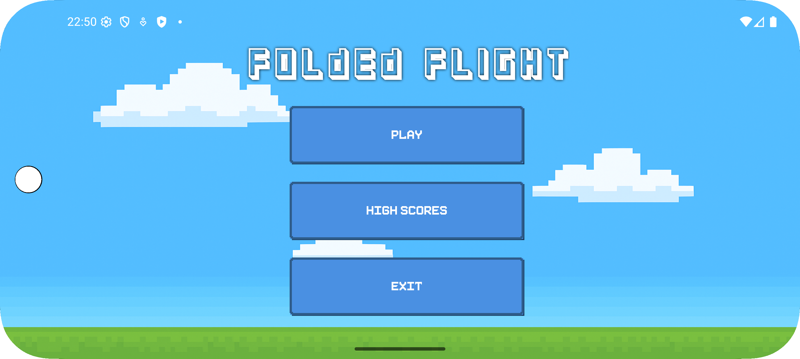

*Retro-styled main menu with pixel art buttons*

</div>

### Game Settings
<div align="center">

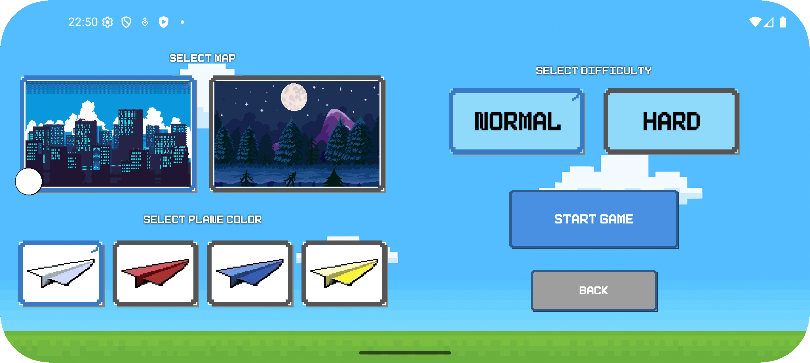

*Configure your flight: map, plane color, and difficulty*

</div>

### Gameplay - City Map
<div align="center">

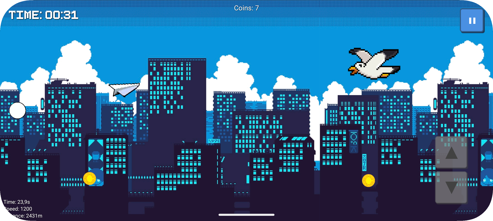

*Navigate through urban obstacles in the city skyline*

</div>

### Gameplay - Forest Map
<div align="center">

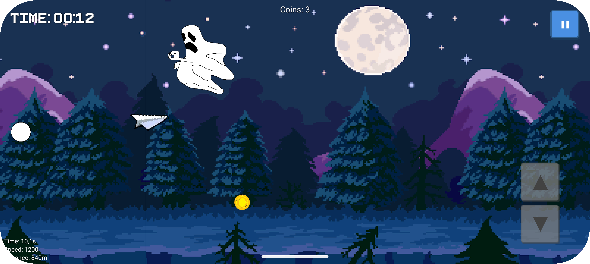

*Fly through the mystical forest environment*

</div>

### Game Over
<div align="center">

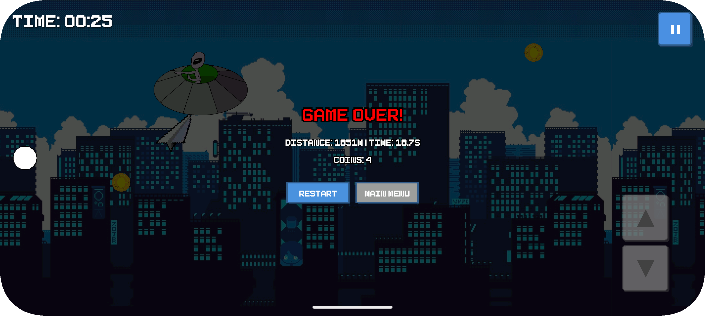

*Final statistics display with distance, time, and coins collected*

</div>

### High Scores
<div align="center">

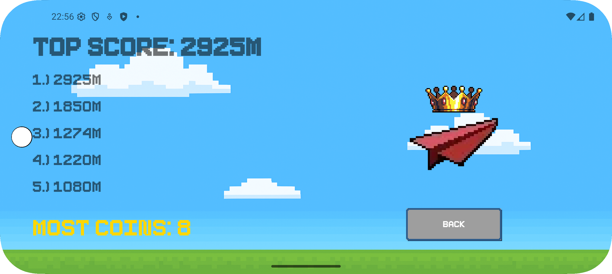

*Leaderboard showing top 5 distances and most coins collected*

</div>

---

## Architecture

### Activities Overview

```
MainActivity
    ├── GameSettingsActivity
    │   └── GameplayActivity
    │       └── (Game Over → HighScoreActivity)
    └── HighScoreActivity
```

#### **MainActivity**
Entry point with main menu navigation
- Play button → Game Settings
- High Scores button → Leaderboard
- Exit button → Close app

#### **GameSettingsActivity**
Pre-game configuration screen
- Map selection (City/Forest)
- Plane color picker (4 options)
- Difficulty selector (Normal/Hard)
- Visual card-based interface

#### **GameplayActivity**
Core game experience
- Real-time physics simulation
- Obstacle/coin spawning and collision
- Timer and score tracking
- Pause menu with Resume/Restart/Exit
- Game over screen with statistics

#### **HighScoreActivity**
Achievement display
- Top 5 distance-based scores
- Most coins collected record
- Persistent storage via SharedPreferences

---

## 🎯 Scoring System

### Distance Score (Primary)
- **Metric**: Total distance traveled in meters
- **Calculation**: `plane.getX() / 10`
- **Display**: Top 5 scores

### Coin Collection (Secondary)
- **Metric**: Total coins collected in single run
- **Record**: Best single-run performance saved
- **Display**: Gold text highlight on High Scores screen

---

## 🎨 Custom UI Components

### PixelButton
8-bit retro-styled button with:
- Chunky pixel borders and corners
- 3D shadow effect
- Press animation
- Custom font support (Pixelboy)

### PixelCard
Selectable card component featuring:
- Image display (maps, planes, difficulty)
- Visual selection state
- Checkmark indicator
- Press feedback animation

---

## Technical Specifications

### Platform Requirements
- **Minimum SDK**: Android 27 (Oreo 8.1)
- **Target SDK**: Android 36
- **Orientation**: Landscape (locked)
- **Screen**: Fullscreen immersive mode

### Performance
- **Frame Rate**: 60 FPS target
- **Rendering**: SurfaceView with Canvas
- **Threading**: Dedicated game loop thread
- **Delta Time**: Frame-independent physics

### Key Technologies
- **Physics Engine**: Custom PlanePhysics system
- **Graphics**: Bitmap rendering with pixel-perfect scaling
- **Data Persistence**: SharedPreferences
- **UI**: Custom view components (PixelButton, PixelCard)

---

## Installation

### Prerequisites
```bash
- Android Studio Arctic Fox or later
- JDK 11+
- Android SDK 27+
```

### Build Steps

1. **Clone the repository**
```bash
git clone https://github.com/yourusername/folded-flight.git
cd folded-flight
```

2. **Open in Android Studio**
```bash
File → Open → Select project directory
```

3. **Sync Gradle**
```bash
Tools → Sync Project with Gradle Files
```

4. **Build and Run**
```bash
Run → Run 'app'
```

Or use Gradle command:
```bash
./gradlew assembleDebug
```

---

## 📂 Project Structure

```
app/
├── src/main/
│   ├── java/com/oddghosts/foldedflight/
│   │   ├── MainActivity.java
│   │   ├── GameSettingsActivity.java
│   │   ├── GameplayActivity.java
│   │   ├── HighScoreActivity.java
│   │   ├── game/
│   │   │   ├── GameSurfaceView.java
│   │   │   ├── PlanePhysics.java
│   │   │   ├── Obstacle.java
│   │   │   └── Coin.java
│   │   └── ui/
│   │       ├── PixelButton.java
│   │       └── PixelCard.java
│   ├── res/
│   │   ├── drawable/          # Game sprites and backgrounds
│   │   ├── font/              # Pixelboy retro font
│   │   ├── layout/            # Activity layouts
│   │   └── values/            # Strings, colors, themes
│   └── AndroidManifest.xml
├── build.gradle.kts
└── proguard-rules.pro
```

---

## Credits

### Development Team
- **Plane Physics System & Debugger**: Elijah Camp
- **Obstacle & Coin Systems**: Maxwell Heller
- **High Score View**: Helena Gonzales
- **UI, Obstacle Design, Game Settings View, Main Menu**: Nha Truong

### Assets & Resources
- **Font**: [Pixelboy](https://www.dafont.com/pixelboy.font) - Retro pixel font
- **Graphics**: Custom pixel art sprites

---

## Roadmap

### Planned Features
- [ ] Additional map environments (Desert, Ocean, Space)
- [ ] Power-ups system (Shield, Speed Boost, Magnet)
- [ ] Achievement system
- [ ] Sound effects and background music
- [ ] Plane unlocking system
- [ ] Weather effects (Wind, Rain)

---

[Back to Top](#-folded-flight)

</div>